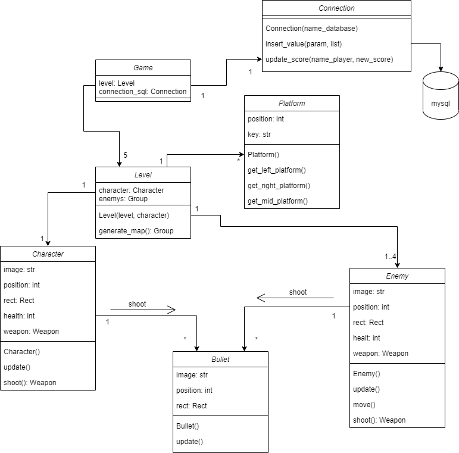

# Proyecto de Programación Avanzada 2021.02

## Proyecto

Construcción de un videojuego con un mínimo de 5 niveles. Debe incluir input, manipulación de tiempo y colisiones.

## Conocimiento necesarios:

1. [Pygame](https://www.pygame.org/news "Pygame")
2. [Manipulación del tiempo en el juego](https://www.pygame.org/docs/ref/time.html "Manipulación del tiempo en el juego")
3. [Sprites](https://www.pygame.org/docs/ref/sprite.html "Sprites")
4. Input del usuario
5. [Detección de colisiones](https://www.pygame.org/docs/ref/sprite.html#pygame.sprite.spritecollideany)

## Diseño
### Organización
------------
    ├── img
    ├── resources
    │   ├── fonts
    │   ├── images
    │   └── sounds
    ├── src
    │   ├── bullet
    │   │   ├── __init__.py
	│   │   └── Bullet.py
    │   ├── character
    │   │   ├── __init__.py
	│   │   └── Character.py
    │   ├── enemy
    │   │   ├── __init__.py
	│   │   └── Enemy.py
    │   ├── level
    │   │   ├── __init__.py
	│   │   └── Level.py
    │   ├── platform
    │   │   ├── __init__.py
	│   │   └── Platform.py
    │   ├── sql
    │   │   ├── __init__.py
	│   │   └── Connection.py
    │   └── main.py
--------
### Diagrama de clases

